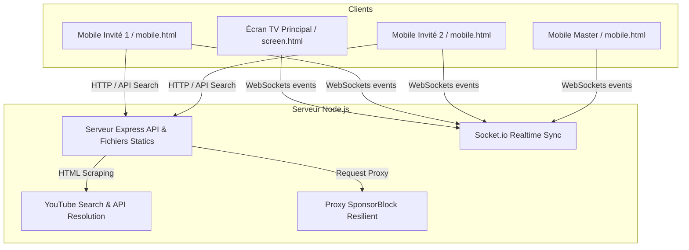

# 🎵 YoutubeParty — Spécifications Techniques & Guide de Développement

Ce document fait office de référence technique (**GEMINI.md**) pour comprendre l'architecture, le fonctionnement et la structure du projet **YoutubeParty**. Il s'adresse aux développeurs ainsi qu'aux agents d'IA pour faciliter la maintenance et l'évolution de la base de code.

---

## 📌 Présentation du Projet
**YoutubeParty** est un système de jukebox vidéo / karaoké collaboratif conçu pour les soirées. 
* Un **Écran Principal** (généralement un PC branché à une TV ou un vidéoprojecteur) diffuse les vidéos.
* Des **Télécommandes Mobiles** (accessibles sur smartphone via un QR Code affiché sur l'écran principal) permettent aux invités d'ajouter des musiques à la file d'attente, de réagir en temps réel ou de voter.



---

## 📂 Structure du Projet

```text
YoutubeParty/
├── .gitignore            # Règles d'exclusion Git (exclut node_modules, masters.json, raccourcis *.lnk)
├── masters.json          # Sauvegarde persistante des User IDs disposant du rôle Master
├── package.json          # Dépendances Node.js (express, socket.io, qrcode)
├── server.js             # Serveur principal Node.js (gestion d'état, WebSockets et API)
├── start.bat             # Script Windows de lancement rapide (serveur + ouverture TV)
└── public/               # Ressources frontend (HTML, JS, CSS)
    ├── mobile.html       # Interface télécommande pour smartphones
    ├── mobile.js         # Logique applicative de la télécommande
    ├── screen.html       # Interface de l'écran TV (lecteur YouTube incrusté)
    ├── screen.js         # Logique applicative de l'écran TV
    └── style.css         # Système de design global (Glassmorphism & Neon)
```

---

## ⚙️ Architecture Technique

### 1. Backend (`server.js`)
Développé avec **Express** et **Socket.io**, il gère l'état de l'application en mémoire vive :
* **Playlist / File d'attente (`queue`)** : Tableau des pistes à suivre.
* **Historique (`history`)** : Les 30 dernières vidéos jouées pour permettre un retour arrière.
* **Clients connectés (`clients`)** : Liste des sockets connectées et typées.
* **Veto (`vetoVotes`)** : Ensemble d'identifiants uniques d'utilisateurs ayant voté pour zapper la chanson en cours.

### 2. Frontend TV (`public/screen.html` & `public/screen.js`)
* Intègre l'**API YouTube Iframe Player** pour contrôler la lecture, le volume et le statut (lecture/pause/fin).
* Débloque le son de manière invisible au premier clic utilisateur (bypass des règles d'Autoplay des navigateurs modernes).
* Affiche un menu d'administration permettant de promouvoir un utilisateur au rôle de **Master** ou d'activer le mode **Fair-Play**.

### 3. Frontend Mobile (`public/mobile.html` & `public/mobile.js`)
* Processus de connexion nécessitant la saisie d'un pseudo (stocké localement avec un `userId` persistant).
* Deux onglets principaux : **Recherche** et **Playlist**.
* Une interface dynamique adaptant ses boutons en fonction du rôle de l'utilisateur (les boutons administrateur/master ne sont visibles et interactifs que pour le rôle `Master`).

---

## 🚀 Fonctionnalités Clés & Logique Métier

### 🔍 1. Recherche & Résolution YouTube Résiliente (`/api/search`)
Pour éviter l'obligation d'avoir une clé API YouTube v3 (sujette à des quotas stricts), le serveur implémente une stratégie de recherche à deux niveaux :
1. **Recherche par scraping natif** : Le serveur effectue une requête HTTP sur YouTube, simulant un navigateur, et extrait les données de `ytInitialData` via une expression rationnelle multi-lignes. Un cookie de consentement (`CONSENT=YES...`) est transmis pour contourner les popups de RGPD.
2. **Résolution directe d'URL** : Si l'utilisateur colle un lien ou un ID vidéo direct, le serveur utilise l'API publique OEmbed de YouTube (`https://www.youtube.com/oembed`) pour récupérer le titre et la miniature instantanément.
3. **Clé API optionnelle** : Si `YOUTUBE_API_KEY` est configurée dans le fichier, elle est interrogée en priorité.

### 🛡️ 2. Saut de segments non musicaux (SponsorBlock)
Pour éliminer les intros parlées ou les publicités intégrées aux clips, l'écran TV interroge un endpoint proxy local `/api/sponsorblock/:videoId`.
Le serveur Node.js interroge en cascade plusieurs miroirs SponsorBlock (`sponsor.ajay.app`, `sponsorblock.kavin.rocks`, etc.) pour assurer une haute disponibilité. Si des segments de type `music_offtopic` ou `sponsor` sont détectés, l'écran TV effectue un saut (`seekTo`) automatique à la fin du segment concerné en affichant une notification discrète.

### 👑 3. Rôles et Permissions persistantes
* **Guest** : Rôle par défaut de tout nouvel invité. Peut ajouter des vidéos, envoyer des réactions et voter pour le veto.
* **Master** : Rôle d'administration de la soirée. Peut zapper (skip/previous), réordonner la file d'attente, ajuster le volume, activer le mode Fair-Play et supprimer n'importe quel clip.
* **Persistance** : Lorsqu'un mobile est promu *Master* depuis le panneau d'administration de l'écran principal, son `userId` (généré aléatoirement et stocké dans le `localStorage` du smartphone) est enregistré dans le fichier `masters.json` pour conserver ses droits même s'il actualise sa page ou se déconnecte temporairement.

### ⚖️ 4. Algorithme de File d'Attente Équitable (Mode Fair-Play)
Pour éviter qu'un seul invité ne monopolise la soirée en ajoutant 15 chansons à la suite, le mode Fair-Play (`reorderFairPlay` dans le serveur) réorganise dynamiquement la file d'attente à chaque nouvel ajout.
L'algorithme regroupe les chansons par utilisateur (`addedById`) et reconstruit la file d'attente en alternant les tours de table (Chanson 1 de User A, puis Chanson 1 de User B, puis Chanson 2 de User A, etc.).

### 🗳️ 5. Veto Collectif Démocratique
Si aucun Master n'est disponible ou si la majorité n'aime pas le morceau actuel :
* Les invités peuvent cliquer sur "VETO".
* Le seuil de validation est calculé de manière dynamique : `Math.ceil(Nombre_d_invités_actifs / 2)`.
* Dès que le nombre de votes veto atteint ce seuil, la vidéo en cours est immédiatement coupée et la suivante démarre.

### 🗂️ 6. Interface TV Repliable & Immersive
L'interface TV a été optimisée pour réduire les distractions visuelles et offrir une immersion totale :
* **Cartes repliables** : Les blocs "À suivre" et "QR Code" démarrent repliés (pastilles compactes). Ils peuvent être dépliés d'un simple clic.
* **Persistance du QR Code** : Si le QR code est déplié, il reste visible en permanence à l'écran, même lorsque l'overlay de contrôle principal et le pointeur de la souris s'estompent. S'il est plié, il disparaît proprement avec l'overlay.
* **Silencing des commandes distantes** : Les commandes envoyées depuis les mobiles (seek, volume, play/pause, skip) ne font plus clignoter ni apparaître l'overlay complet sur la TV. Seules les notifications importantes (toasts) s'affichent temporairement.

### ⏱️ 7. Notification "Son Suivant" Dynamique
Dans les 30 dernières secondes d'une chanson, un toast élégant apparaît en bas à droite de la TV pour annoncer le prochain morceau (miniature, titre et compte à rebours).
* **Positionnement dynamique** : Il est ancré au coin inférieur droit de l'écran (`bottom: 3rem`). Si les contrôles de la TV s'affichent, il remonte fluidement à `bottom: 12rem` pour laisser place au bandeau de contrôle sans aucune collision.

### 🖱️ 8. Interaction "Média" Intelligente
* **Clic dans le vide** : Cliquer n'importe où dans le vide sur la TV met en pause ou relance la vidéo (comportement identique au lecteur YouTube officiel).
* **Raccourcis clavier** : La touche `Espace` contrôle Play/Pause, tandis que les touches `Flèche Droite` et `Flèche Gauche` permettent de zapper au morceau suivant ou précédent.
* **Masquage du curseur** : Le pointeur de la souris disparaît automatiquement après 3 secondes d'inactivité pour une expérience visuelle épurée (style cinéma / TV connectée).

---

## ⚡ Événements Socket.io (Protocole Réseau)

### Émis par le Serveur (`io.emit` / `socket.emit`)
* `connection_established` : Transmet le `socketId` affecté au client mobile lors de sa connexion.
* `role_updated` : Notifie un client mobile de son rôle actuel (`Guest` ou `Master`).
* `state_update` : Transmet l'état complet du serveur (liste des clients connectés, file d'attente, état de lecture, paramètres veto et fair-play).
* `queue_updated` : Diffuse uniquement la playlist mise à jour et la vidéo active.
* `tv_command` : Transmet des commandes d'exécution à l'Écran TV (`load_video`, `play`, `pause`, `volume`, `show_idle`).
* `emoji_reaction` : Transmet un émoji réaction à afficher sur la TV.
* `progress_update` : Relaye la progression temporelle de la vidéo en cours vers les smartphones.

### Émis par les Clients (`socket.emit`)
* `join` : Enregistre le client (`{ type: 'screen' }` ou `{ type: 'mobile', nickname, userId }`).
* `add_to_queue` / `add_to_queue_first` : Demande d'ajout d'une vidéo (en fin ou en tête de file).
* `role_change` : Demande de modification de rôle (émis par la TV).
* `player_command` : Envoie une instruction de contrôle (`play`, `pause`, `skip`, `previous`, `volume`, `remove`, `seek`).
* `reorder_queue` : Modifie l'ordre de la file d'attente.
* `vote_veto` : Soumet ou retire un vote de veto.
* `toggle_fairplay` : Active ou désactive le mode Fair-Play.
* `emoji_reaction` : Envoie une réaction.
* `progress_update` : Transmet la position actuelle du lecteur (émis par la TV).
* `video_started` / `video_ended` : Confirme le statut de lecture de la vidéo en cours (émis par la TV).

---

## 🛠️ Instructions d'Installation et Lancement

### Prérequis
* Node.js (version 16 ou supérieure recommandé)

### Installation
1. Clonez ou copiez le répertoire du projet.
2. Installez les dépendances requises :
   ```bash
   npm install
   ```

### Lancement
* **Sous Windows** : Double-cliquez sur `start.bat`. Ce script lance automatiquement le serveur et ouvre `http://localhost:3000/screen.html` dans le navigateur par défaut après 2 secondes.
* **Via Terminal** :
   ```bash
   npm start
   ```
   Accédez ensuite manuellement à :
   * **Écran TV** : `http://localhost:3000/screen.html`
   * **Mobile** : `http://<IP_LOCALE>:3000/mobile.html` (ou via le QR Code affiché sur l'écran TV)

---

## 🎨 Design System et UI/UX
L'application arbore une identité moderne conçue pour une ambiance de fête nocturne :
* **Thème** : Dark-mode premium avec des accents néons dynamiques (dégradé violet/cyan via `--gradient-neon`).
* **Effets visuels** : Utilisation intensive du *glassmorphism* (panneaux semi-transparents floutés via `backdrop-filter: blur(24px)` et bordures subtiles).
* **Animations** : Transitions douces lors des interactions, effets de pulsation lumineuse sur les alertes (veto) et envolées d'émojis flottants (`@keyframes floatEmoji`).
* **Polices** : Sans-serif moderne (inter/system) avec des indicateurs de temps à chasse fixe (monospace) pour éviter les sauts visuels sur les timers.
